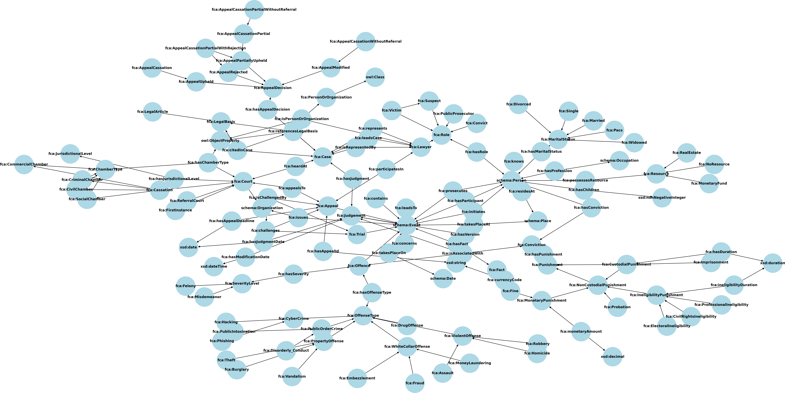

# Information extraction from Legal Documents
This packages contains:
- a criminal ontology for criminal appeals to the French Cassation Court (2023)
- a pipeline for fetching pdfs of appeals from [the French Cassation Court](https://www.courdecassation.fr/)  
- a pipeline for deriving RDF triples from the appeals pdfs (based on GPT-4o mini) 
- upload pipeline to Fuseki triple store
- sparql analysis scripts 


### Downloading court decisions use geckodriver

1. Download gecko driver
```shell
wget https://github.com/mozilla/geckodriver/releases/download/v0.32.0/geckodriver-v0.32.0-linux64.tar.gz
 ``` 

2. run it (default port is 4444)

3. scrape

### setting up triple store (Fuseki)

```shell
cd docker/fuseki
cp .example.env .env

```

### Appeals Ontology



